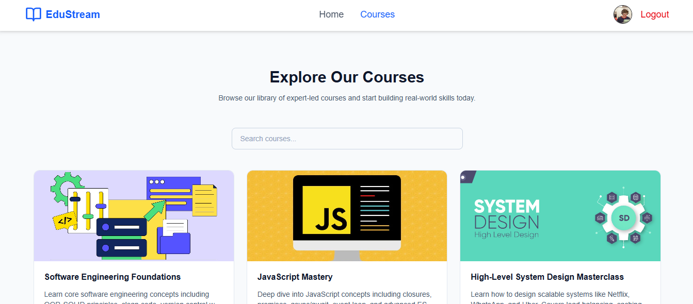
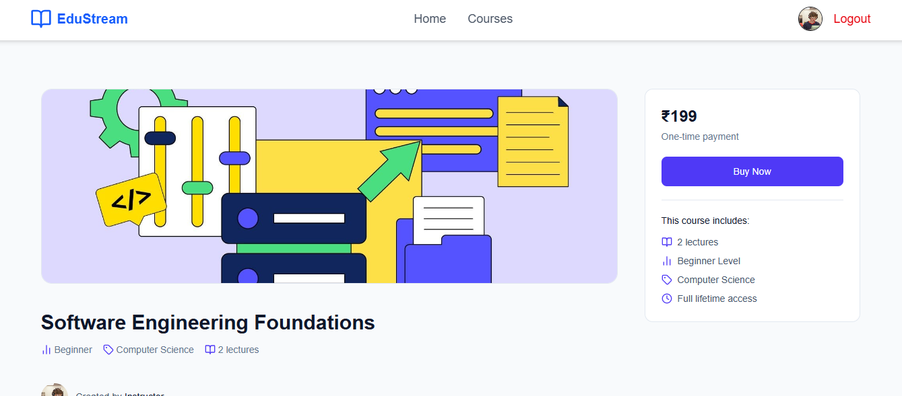
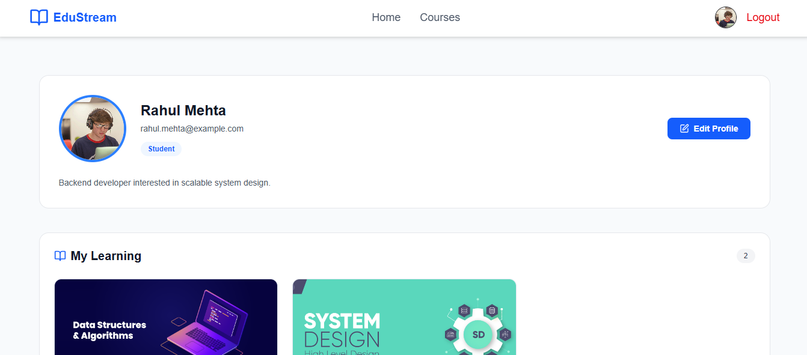
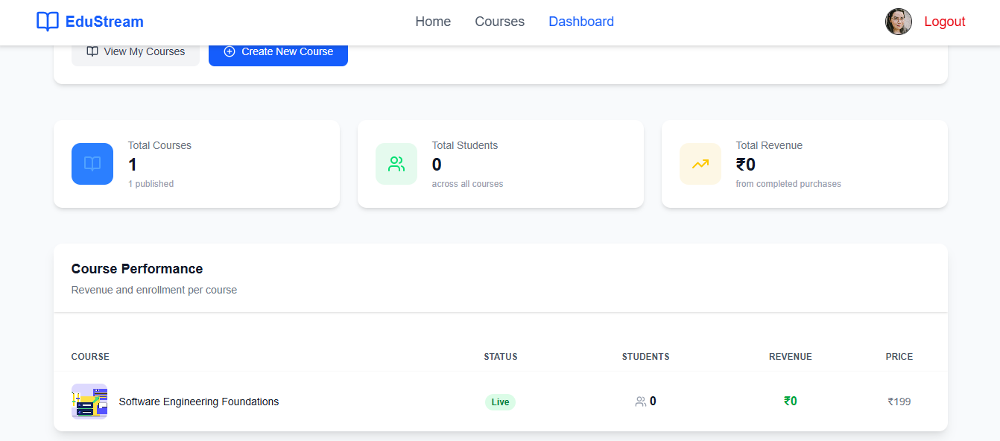
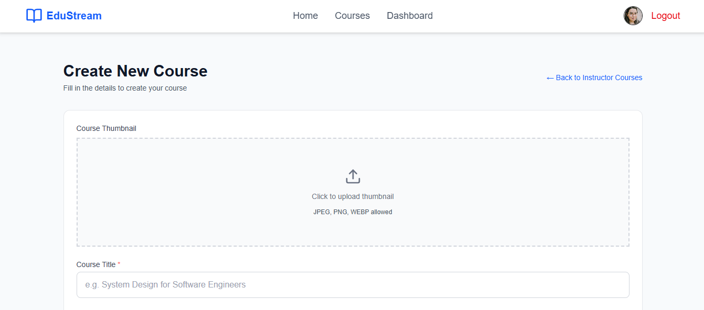
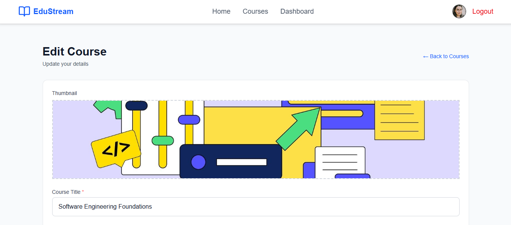
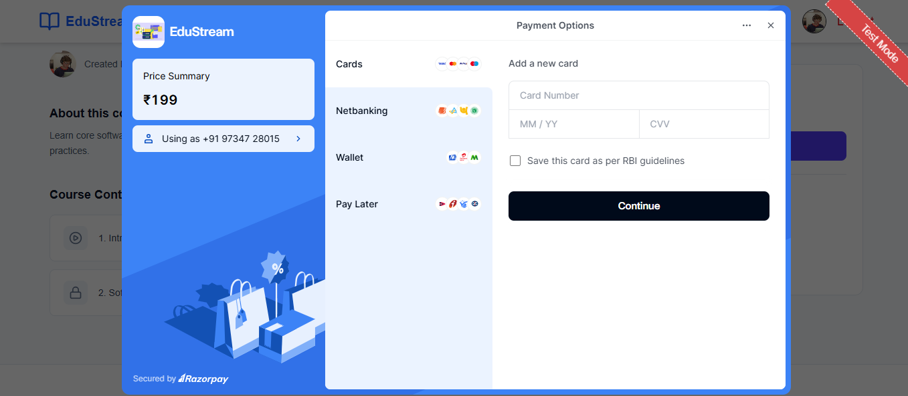
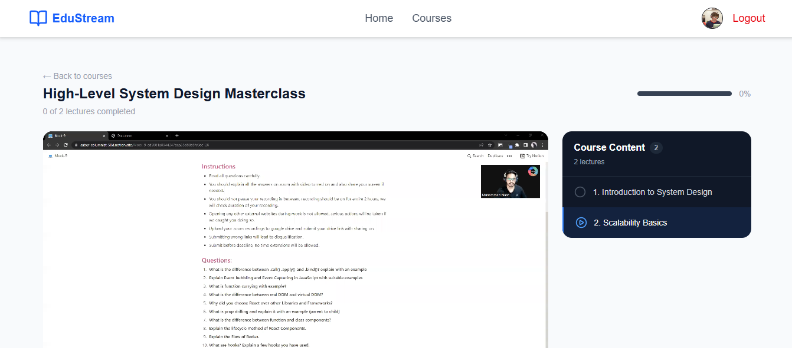

# EduStream — Learning Management System

EduStream is a **full-stack Learning Management System** built using the **MERN stack**, allowing instructors to create and manage courses while students can purchase, track progress, and learn seamlessly.

## 🚀 Live Demo
- **Frontend:** https://edustream-lms-client.vercel.app
- **Backend:** https://edustream-lms.onrender.com

## ✨ Features
- 🔐 JWT authentication using httpOnly cookies
- 👥 Role-based access control (Student / Instructor)
- 📚 Course creation & management
- 🖼️ Course thumbnail upload
- 🎥 Video lecture streaming via Cloudinary
- 💳 Secure payments with Razorpay (Test Mode)
- 📊 Course progress tracking
- 📱 Fully responsive UI with Tailwind CSS

## 🛠️ Tech Stack

| Layer      | Technologies |
|-----------|--------------|
| Frontend  | React, Redux Toolkit, Tailwind CSS, React Router |
| Backend   | Node.js, Express.js |
| Database  | MongoDB, Mongoose |
| Auth      | JWT, bcrypt |
| Media     | Cloudinary |
| Payments  | Razorpay |
| Hosting   | Vercel (Frontend), Render (Backend) |

---

## 💳 Razorpay Payment Demo (Test Mode)

This project uses **Razorpay Sandbox**, so **no real money is charged**.

### How to test payments

1. Click **Buy Now** on any course  
2. Enter **any valid Indian mobile number** (e.g. `9876543210`)  
3. Choose **Netbanking**  
4. Select **any bank**  
5. On the test bank page, click **Success**  
6. You’ll be enrolled and redirected to the course player  

> ⚠️ Do not use real card details. This is a test environment.

---

## 🔧 Installation & Setup

### Prerequisites
- Node.js (v18+)
- MongoDB Atlas account
- Cloudinary account
- Razorpay account

### 1. Clone the repository
```bash
git clone https://github.com/your-username/LMS.git
```

### 2. Backend Setup
```bash
cd server
npm install
```

Create a `.env` file in the `server` folder:
```bash
PORT=3000
NODE_ENV=development
MONGO_URI=your_mongodb_connection_string
JWT_SECRET=your_jwt_secret
CLOUDINARY_CLOUD_NAME=your_cloud_name
CLOUDINARY_API_KEY=your_api_key
CLOUDINARY_API_SECRET=your_api_secret
RAZORPAY_KEY_ID=your_razorpay_key_id
RAZORPAY_KEY_SECRET=your_razorpay_key_secret
CLIENT_URL=http://localhost:5173
```

Run the backend:
```bash
npm run dev
```
Server runs on `http://localhost:3000`

### 3. Frontend Setup
```bash
cd client
npm install
```

Create a `.env` file in the `client` folder:
```bash
VITE_SERVER_URL=http://localhost:3000
```

Run the frontend:
```bash
npm run dev
```
App runs on `http://localhost:5173`

### 4. Create accounts
- **MongoDB Atlas** — [mongodb.com/atlas](https://mongodb.com/atlas) → create free cluster → get connection string
- **Cloudinary** — [cloudinary.com](https://cloudinary.com) → dashboard → get API keys
- **Razorpay** — [razorpay.com](https://razorpay.com) → generate test mode API keys


## 📌 Future Improvements
- Instructor analytics dashboard
- Course reviews & ratings
- Admin panel
- Live classes integration

## 📸 Screenshots

### Home Page


### Courses Page


### Course Detail


### Student Profile


### Instructor Dashboard


### Create Course


### Edit Course - Lectures


### Razorpay Checkout


### Course Progress (Video Player)



## 👨‍💻 Author

Vinod Hadmode: MERN Stack Developer